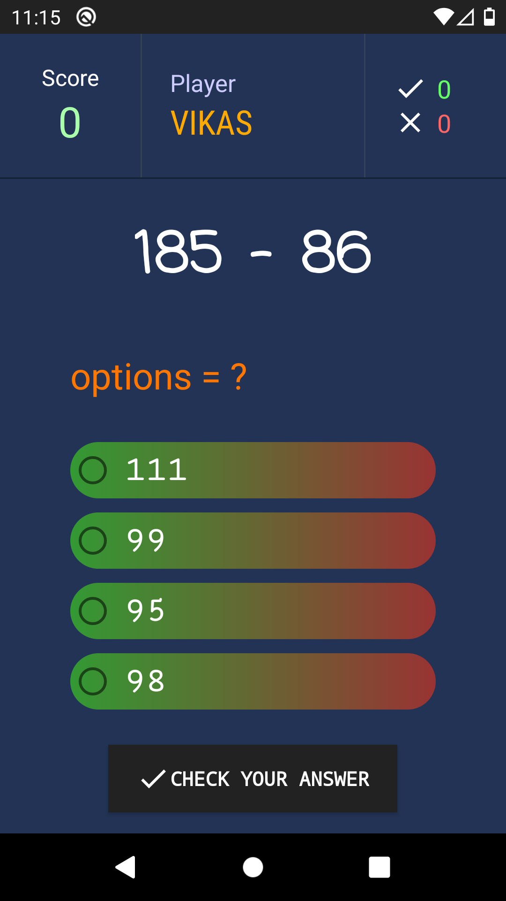

# Maths Time Game

A simple maths game for kids I developed when I was just starting out android development, so it might be a good project for beginners in android development to improve upon their skills.

## Screenshots

<!-- 

 -->

 
 

## How to run the game?

1. Clone the repo
2. Open in Android Studio
3. Build project
4. Run in android emulator / device

## Support

- Feel free to modify and update this as I am unable to get much time.
- Contribute to this project
- share with your friends (android devs)

### Thank You
🤟 Happy Coding